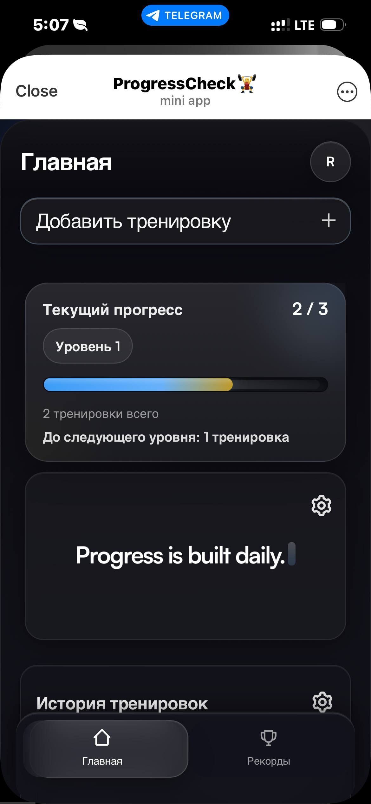
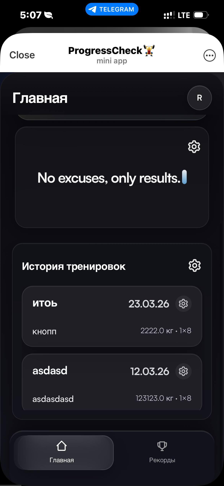
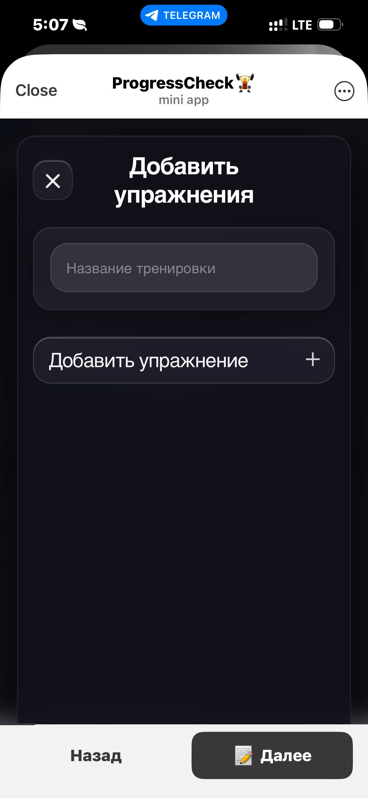
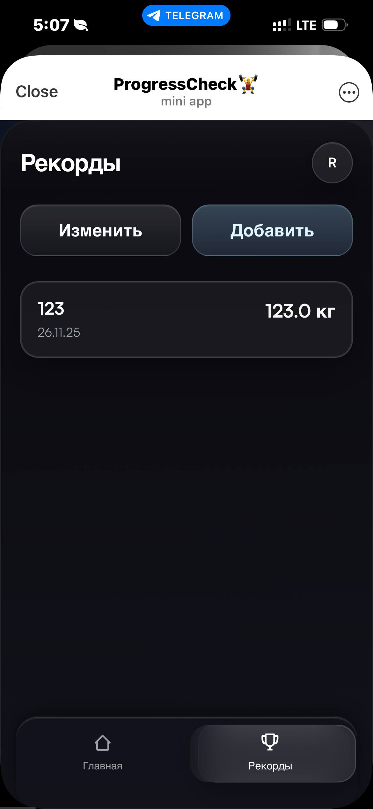

# ProgressCheck

Telegram-бот и Telegram Mini App для учёта тренировок, рекордов, профиля и цитат. Данные хранятся в `SQLite`, основной интерфейс работает внутри Telegram.

## Быстрый обзор

- Telegram Bot + Mini App в одном репозитории
- backend на Python: `aiogram` + `FastAPI`
- хранение данных в `SQLite`
- тренировки, рекорды, профиль, цитаты
- запуск через один `python main.py`

## Скриншоты

<table>
  <tr>
    <td align="center"><strong>Главный экран</strong><br></td>
    <td align="center"><strong>История тренировок</strong><br></td>
  </tr>
  <tr>
    <td align="center"><strong>Добавление тренировки</strong><br></td>
    <td align="center"><strong>Рекорды</strong><br></td>
  </tr>
</table>

## Что делает

- регистрирует пользователя через `/start`;
- собирает и обновляет профиль;
- сохраняет тренировки и историю;
- хранит личные рекорды;
- открывает Mini App для основной работы с данными;
- поддерживает FAQ, видео-инструкцию и админ-команды.

## Стек

- Python 3
- `aiogram 3`
- `FastAPI`
- `uvicorn`
- `SQLite`
- HTML / CSS / JavaScript
- Telegram Web App API

## Как работает

```text
Пользователь -> Telegram Bot -> handlers -> SQLite
                      \
                       -> Mini App -> FastAPI -> SQLite
```

- бот отвечает за команды и onboarding;
- Mini App отвечает за интерфейс;
- backend и бот работают в одном процессе.

## Структура проекта

- `main.py` — запуск бота и FastAPI-сервера Mini App.
- `bot/handlers.py` — команды, FSM-анкета, админские сценарии.
- `bot/keyboards.py` — Telegram-клавиатуры и URL Mini App.
- `bot/db.py` — схема `SQLite` и работа с данными.
- `webapp/server.py` — FastAPI API и раздача Mini App.
- `webapp/static/` — текущий фронтенд Mini App.
- `frontend/user-level/` — исходники виджета уровня.

## Установка

```bash
git clone <URL_РЕПОЗИТОРИЯ>
cd progresscheck
python3 -m venv .venv
source .venv/bin/activate
pip install -r requirements.txt
```

Создайте `.env`:

```env
BOT_TOKEN=your_telegram_bot_token
MINI_APP_URL=https://your-domain.example
WEBAPP_HOST=127.0.0.1
WEBAPP_PORT=8080
FEEDBACK_FORM_URL=https://your-form-url.example
ADMIN_ID=123456789
ADMIN_IDS=123456789,987654321
```

Если нужно пересобирать виджет уровня:

```bash
npm install
```

## Запуск

```bash
python main.py
```

Если меняли `frontend/user-level`:

```bash
npm run build:user-level
```

## Пример использования

Команды:

```text
/start
/feedback
/video
/admin
/stats
/broadcast
```

Сценарий:

1. Пользователь отправляет `/start`.
2. Бот собирает профиль.
3. Пользователь открывает Mini App.
4. В Mini App добавляет тренировки и рекорды.

## Пример данных

```json
{
  "user_id": 123456789,
  "workout_name": "Спина",
  "exercises": [
    { "exercise": "Тяга штанги", "weight": 80, "sets": 4, "reps": 8 }
  ]
}
```

## Хранение данных

Основные таблицы:

- `started_users` — кто запускал бота;
- `users` — профиль пользователя;
- `workouts` — тренировки и рекорды;
- `custom_quotes` — пользовательские цитаты.

## Roadmap

- вынести часть логики из `bot/handlers.py` в сервисный слой;
- завершить переход на модульный фронтенд;
- добавить тесты для API и database-layer;
- добавить миграции для БД;
- заменить `SQLite` на PostgreSQL при росте нагрузки.
